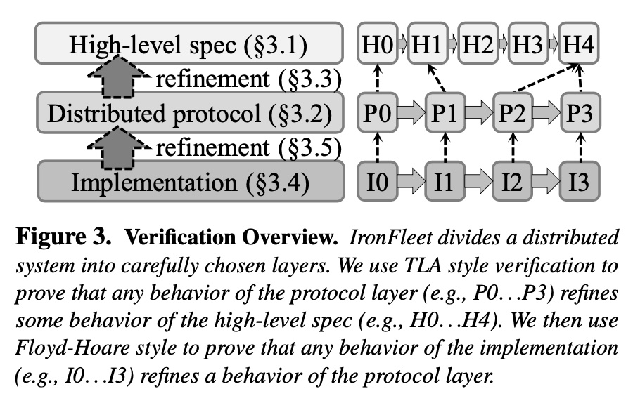

+++
author = "Blitzerr"
title = "The fleet of systems forged in Iron"
date = "2021-11-17"
description = "Iron Fleet Paper by Hawblitzel et. al. at SOSP '15"
image = "ironfleet.jpeg"

draft = true

tags = [

    "distributed-systems",
    "verification",
    "ironfleet"

]

+++

# Problem Statement

In [this](https://www.andrew.cmu.edu/user/bparno/papers/ironfleet.pdf) paper, the authors present an approachst for building a practical distributed system in a provably correct way. They do it incrementally by writing a spec, then a host level protocol and then the inside host implementation, where each step refine the one that comes before it. Before this, most verifications concerned them with part of the protocol but not the whole system. This is huge because this means that it is finally possible to write bug free system with acceptable performance. Separating the spec and the protocol from the implementation helps in dealing with the right abstractions. What it means that we don't have to handle integer overflows and the spec layer and we can deal with all sorts optimizations can come in the implementation phase. Using Dafny, guarantees that the actual implementation never deviates from the claims made by the spec by making sure that the preconditions, post conditions and invariants hold at level.

# Motivation

We have been writing systems for a very long time now. When we started doing so, just havin this automation was a luxury. So people were okay, when we brushed off a bug (or a few) as a "glitch" in the system. But over time, these have become more and more critical. Computer systems are no longer alternatives, they are THE way to do a lot of things. When we wire money to someone, we want the exact amout to be deducted and only once, And guess what when we want the server to push a message to that robot to inject insulin into our grandma, we want the exact dose to be dispensed, because, guess what, applying injection is not idempotent. The exactly once gurantee, or the lack thereof, can be the difference between life and death.

Therefore, it is imporant that any and all mission critical systems work correct way

# Approach

## Assumptions

We should always start with the assumptions we are making for our view of the world. IronFleet also makes certain assumptions:

1. There are axioms that lead to the proof. What I mean is that there are parts, rather small, of the system that are assumed to be correct. In practice this is not a big deal for a system in practice. This means that developers have a very focused piece to direct all their attention to - the unproven code. As long as that is kept small enough, we are fine.
2. The system assumes the network to not tamper with packets. For most practical purposes this is fine as we can use checksumming etc. to guard against it.
3. They assumed the correctness of their compiler. That's okay, I guess.

### Concepts

The actual proof builds on top of three fundamental concepts:

1. State Machine refinement.

   > State machine *L* refines *H* if each of *L*’s possible *behaviors*, i.e., each (potentially infinite) sequence of states the machine may visit, 

2. Floyd-Hoare Verification

   > A tool that allows the programmer to annotate a program with assertions about the program’s state, and the verifier checks that the assertions hold true for all possible program inputs

3. Reductions

   > The concept that two steps can swap places in the behavior if swapping them has no effect on the execution’s outcome

4. Temporal Logic Of Actions

### Methodology

#### Key points

1. Break down the large problem into layers
2. Define the transition within a layer
3. Tie some states of the layer with the some states of the layer below it.

The crux of the proof lies in very meticulously definiting the right set of abstractions, each layering on top of the other or the lower layer refining the top one such that together we have a verified system that performs its operations efficiently.



_We use TLA style verification to prove that any behavior of the protocol layer (e.g., P0*...*P3) refines some behavior of the high-level spec (e.g., H0*...*H4). We then use Floyd-Hoare style to prove that any behavior of the implementation (e.g., I0*...*I3) refines a behavior of the protocol layer._

#### Running Example

Our running example is going to be of a lock server. The server coordinates the access to the lock between the clients. The system state is modelled as the history of lock ownership at any given epoch. So, if you query the state of the system at epoch-n, the system will tell you which host owned the lock then. One would realize that the history and therefore by extension, the state is ever growing and a new step is arrived at by appending to the history the owner of the lock in the new epoch. 

An implementation is considered consistent with the spec, if the n-th host is the sender of all the lock messages in the epoch-n. This is something that I don't understand very clearly. If the spec already knew the host that is going to send all the lock messages in the epoch-n, then the spec is sort of predicting every move of the system. But that is not how I think of the system. To, me one or many host would want the lock at an epoch and the implementation will grant it one of the asking hosts. The spec should make sure that the System invariant is held during that passing along of the lock - usually for a locking system, it is that there should not be two owners of the lock at any given point of time.

There are usually two aspects to this. The lock server is distributed, so a quorum of the nodes forming the server has to agree who is the owner of the lock at any given point of time, in the face of fail-stop failures and grey failures, slow server gc pauses, os scheduling and the like. Then there is client side of it. I think teh toy example considered in the paper is client centric. 

### Spec

```rust
// The spec is usually modelled as a state transition and therefore, we start with the state of the system.
datatype SpecState = SpecState(history:seq<HostId>)

// Initial state of the system. This is the starting point. You start here and you apply the rules of transitions to get to the next state and continue.Usually, the movement happens based on certain actions that are performed on the stytem. The actions are usually the API calls on the system or background jobs that can lead to a state transition. A system would evlaute 
predicate SpecInit(ss:SpecState) { 
  |ss.history|==1 && 
  ss.history[0] in AllHostIds() 
}

predicate SpecNext(ss_old:SpecState,ss_new:SpecState) { 
  exists new_holder :: new_holder in AllHostIds() && 
  ss_new.history == ss_old.history + [new_holder] 
}

// This is very important relation as it ties a spec state to a state of the implemntation. The number of steps in a layer does not have to be equal to the steps in the layer below but these are the validation points where we determine that the implementation adheres to the protocol and the protocol adheres to the spec.
// So, say we have a structure called 
// Msg {
//  // If this message is about requesting a lock.
//	lock,
//.  The epoch for this message. The epoch is imporpant as that's how we index into the history or the state of the system in the spec.
//  epoch,
//. // The sender of the message.
//  src,
//}

// The relation simply states the all the messages regarding a lock that are sent from the host that the history calls out as the owner of lock. This is a circular dependency to me, wecannot obtain the history by 
predicate SpecRelation(is:ImplState,ss:SpecState) {
  forall p :: p in is.sentPackets && 
  p.msg.lock? ==> p.src == ss.history[p.msg.epoch] 
}
```

​                                                     	_The lock server specification_ 


### The Protocol Layer

This layer models independent hosts communicating with each other through messages over the network. The state of the system is defined as the N hosts that are trying to acquire the lock and the set of all messages that were ever transferred among them. The state transition what is considered as a step of the system. In the protocol layer, a step is taken by the system, when one of the many hosts, reads the messages in its input buffer, does some computation and emits the output as other network messages to other hosts in the system. a step is considered to be atomic and therefore the reading of messages, doing some computation based on them and sending the messages out is considered one single atomic step.

```rust
State {
  // This representation of the state pertains to which epoch.
  epoch: Number,
  // The lock owner in this epoch.
  host: id,
  // A lock exchange happens over two messages both seen from the 
  // reference of the lock owner. The send packet is the grant the lock
  // and followed by a receive message to the initial sender accepting 
  // the grant. A successful exchange of the lock should lead to the 
  // system taking a step, which is signified as an increment of the 
  // epoch.
  spck: Msg,
  rpck: Msg,
}

History {
  states: [State]
}

struct Msg {
  transfer: bool,
  lock: bool,
  sendr: id,
  recvr: id,
  epoch: Number,
}

Actions {
  Grant,
  Accept,
}

// A transiion determines the legality of a step. So given the 
// transition rules, one can ask the question that given the
// current state of the system (S) and the action (A) performed 
// on it, is the next state (S') legal. As one can guess the
// answer to this is boolean and therefore modelled as a 
// predicate.
Transitions {
  // At the given epoch, can the lock be granted by the from 
  // from_host to the to_host.
  // The logical answer is, if the from owned the lock in that 
  // epoch, then it can grant it to the to_host.
  Grant(epoch, from, to)? => {
    let State { curr_owner, spck, _ } = state[epoch];
    // Only the owner of the lock can grant it
    spck.epoch == epoch &&
    curr_owner == from &&  // the from host owns the lock as confirmed from the system state history.
    curr_owner != to && // The requester didn't already have the lock
    spck.transfer ? && // This was a lock transfer request
    spck.sendr == from &&
    spck.recvr == to
  },
  Accept(epoch, from, to) => {
    
  }
}
```

## Connecting the Layers

The layers are connected using a refinement function. This takes a state of the protocol and returns a state of the Spec. Then we prove that the protocol refines the Spec by induction. We show that it holds true for the init state and then we show that it


### The Implementation Layer

In Iron fleet, this is where we write the abstraction free and runnable imperative code.  One limitation the paper talks about is that the code should be single threaded. The paper uses Dafny for this purpose.

The key is to prove that the implementation adheres to the protocol layer. This is easier as there is one to one correspondence between the host protocol state and the implementaion state. In other word a step in the implementation layer represents one step in the protocol layer. we know that the state of the distributed-system is the state of all the 'N' hosts combined. But based on how we defined the state transitionon of the overall system -  a step taken by any of the N hosts corresponds to a step taken by the ststem as a whole and steps are atomic and no two hosts takes step at the same time. One might ask how can we gurantee that in a distributed system, no two hosts, take a step at the same time. This is addressed by what is deemed as a legal step. The stystem takes a step when there is a lock exchange. Now the two actions/messages that lead to it are the grant and accept. Now rememeber that the grant can only be successful if the granting host is the owner of the lock at that time. We have meticulously verified that the system, till that point holds the invariant - that there is only one owner of the lock at that time. So, there is only a single host that can successfully grant a lock And because the granting host, will send the grant message to only one host in a given epoch, the next owner of the host will also be unique for that epoch. 

This reasoning only supports the one part of the system state - the state of all the hosts. There is another state variable -  all the messages that were ever sent over the network. 

### looking for atomacity ? Try Reduction


# Results

# Comments

# References
