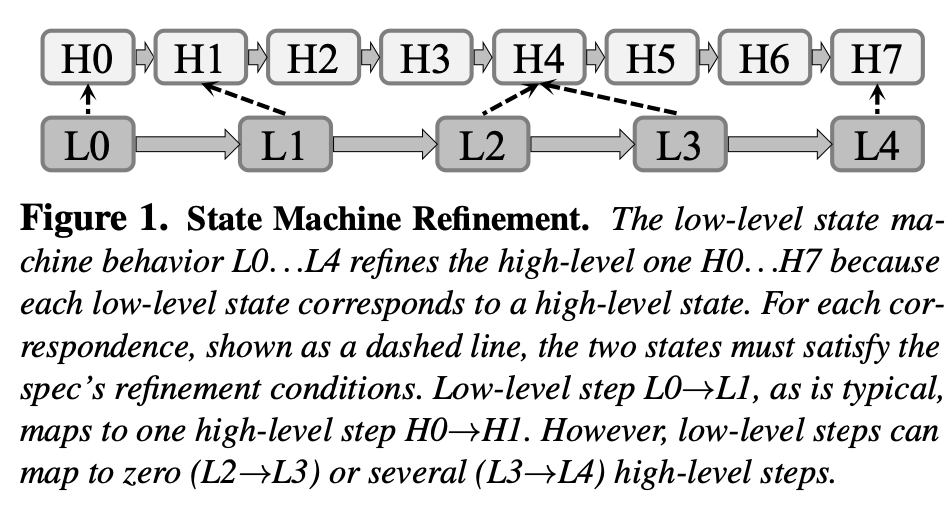

+++
author = "Blitzerr"
title = "The tale of the Iron Born"
date = "2021-10-12"
description = "COQ"
image = "yellow_swirl.jpg"

draft = true	


tags = [
    "distributed-systems",
    "verification",
]

+++

A distributed system is a coordonated group of machines working towards a common objective but to the end use it appears as if they are tallking to a single machine. The common objective can be the utility and the gurantees the system provides such as database, or a stream processor, a batch processing systems. The true complexity of a distributed system design lies in abstracting out the fact that a client is talking to multiple servers behind the scene and not just one of them. If proper care is taken in how you choose these machines (not sharing the same data-centre rack or even building) carefully, a distributed system can be more highly available than a single machine system. High availbaility comes from having multiple copies of the data and in which case if a machine fails you can get the  data from other machines and this must happen transparently for the client. Now, if any replica is capable if serving the requested data, then they must all have the latest version of the data. This is the core of the problem, keeping all copies of the data consistent in face of machine failures or network partitions. 

Putting the problem simply, a distributed systems designer has to wrestle with these four questions - how to deal with writes, which machine should handle the read, how to detect failures and then how to recover from them. All of these are error prone and therefore we want to have enough confidence in our design. There are a few ways we can do that:

1. Write tests. Util tests and integration tests are a good place to start but they only help us catch issues that we already anticipate.
2. There are frameworks like [proptest](https://altsysrq.github.io/proptest-book/intro.html) that help to test whether certain properties of your code hold for an arbitrary set of input and if the code fails, the framework provides a counter-example to the hypothesis. This is great but does not guarantee that it will find all the faliure scenarios.
3. We can subject our system to [Jepsen Analysis](https://jepsen.io/analyses) or their new tool Elle[2]. This generates the system traces and then does an analysis for [database consistency](https://jepsen.io/consistency) violations. This is quite rigorous but again, does not gurantee all the edge cases will be explored. 
4. Exernal fault injection with frameworks such as [Chaos Monkey](https://netflix.github.io/chaosmonkey/).
5. Have exhaustive logs, metrics and traces (the three pillars of Observability). This helps you catch bugs after the fact but does not prevent the occurrence of it. It is also based on the premise that we have sufficient logging enabled around the failure path.
6. Write a simulator for your system before doinf the actual implementation as the [FoundationDB folks did](https://www.youtube.com/watch?v=4fFDFbi3toc).
7. Formal methods based on model checking (exhaustively exploring the state space) or formal verification can generate machine checked proof of the system spec but its very hard to generate the full specification of a system. Systems are complex and they evolve with new features. Its tedious to keep the spec up to date. Another problem is that the spec is maintained separately from the code.

Although the above points might be disheartening, we would still like to write correct distributed systems. And there are ways we can do it. As IronFleet[1] established, it is possible to verify a complex [paxos](https://lamport.azurewebsites.net/pubs/lamport-paxos.pdf)-based [Replicaed State Machine](https://en.wikipedia.org/wiki/State_machine_replication) and use it to implement a shared Key/value store. When you read the paper you realize that one of the hardest part might have been to come up with the invariants in the 


## Writing a system Specification

As Butler Lampson writes in [this paper](https://www.microsoft.com/en-us/research/uploads/prod/2019/09/Hints-and-Principles-v1-full.pdf), the writing of a correct system should always begin at the Specification. There are tools that can help you write one such as $TLA^+$ that can reason about [Temperal Logic](https://link.springer.com/chapter/10.1007/978-3-319-10575-8_2) and proof assistants such as [Coq](https://github.com/coq/coq). The problem with this approach is that the spec and the code are maintained separately and the spec is only for documentation only. Writing a correct spec does not gurantee a correct implementation as there is no system that validates the implementaiton against the proof of correctness. Think of this like a compiler for a language. I compiler writer decides the syntax of the language and then writes a compiler that accepts programs within the bounds of what the language specification allows. The compiler usually does it in a hands-free manner but there are cases where the programmer needs to lead the compiler by hand such as when we have to specify the lifetimes in a rust program explicitly. 

In case of distributed system spec, we want to provide the designer the freedom to come up with the rules of the system. This is important, because we want our spec writing framework to be used with a wide variety of systems and not just one. There are verifiers such as [Dafny](https://dafny-lang.github.io/dafny/) and [Prusti](https://viperproject.github.io/prusti-dev/user-guide/intro.html) that takes specifications as code annotations sprinkled over functions as pre and post conditions. This is consistent wiith the [Floyd-Hoare Logic](https://en.wikipedia.org/wiki/Hoare_logic) which talks about a $3-tuple$ $\{P\}$C$\{Q\}$ where P and Q are assertions also called the pre-condition (restrictions on input written as assertions in predicate logic) and post-conditions (restrictions on output also described as assertions in predicate logic) and $C$ is the command to be executed when the pre-conditions are met generating values consistent with the post-conditions. It is important for the spec to be contained in a module of its own. Having it sprinkled all over can make it hard to read in a large codebase of several million lines which is a commonplace for distributed systems. I would like to think of the spec to be written in a custom DSL in a few `.spec` files. In `Rust` lingo, the spec should be in a separate crate and building a spec should generate dummy top level Protocol stubs with annotations for pre and post conditions. 

### Verifying the Spec

The spec format should be very close to `Rust` format but it should be expressive enough for people to encode the proof Hypothesis and the goal. The goal of a verification tool is given this situation, prove that the constraint holds for all input values and if they don't, then provide a counter example. And then the spec author can tune the invariants and put it up for another round of evaluation against the verification tool and this is repeated.

The [Mikino Bounded Model Checker](https://ocamlpro.github.io/verification_for_dummies/mikino_bmc/index.html) does a great job is staying close to Rust Syntax. 


```rust
// The scenario models a stop-watch with a toggle button which can be 
/// pressed to toggle between start and stop. Whether the stop-watch is 
/// in counting mode or stopped is indicated by the is_counting state 
/// variable. And the value of the counter is provided by the counter. 
/// Reset button sets the counter to 0.

/// State variables.
svars {
    /// Inputs of the system.
    start_stop reset: bool,
    /// Keeps track of whether we are counting.
    is_counting: bool,
    /// Counts time, output of the system.
    cnt: int,
}

/// Initial state of the system.
init {
    is_counting = start_stop,
    cnt ≥ 0,
    (reset ⇒ cnt = 0),
}

/// Transition relation.
trans {
    // The *next* value of `is_counting` is equal to...
    'is_counting = if 'start_stop {
        // ...if `'start_stop` is true, then the negation of
        // its *previous* value...
        ¬is_counting
    } else {
        // ...otherwise, it is equal to its previous value.
        is_counting
    },
    'cnt = if 'reset {
        0
    } else if 'is_counting {
        cnt + 1
    } else {
        cnt
    },
}
/// State invariants.
candidates {
    "cnt is positive": cnt ≥ 0,
    "cnt ≤ 2": cnt ≤ 2,
    "cnt ≤ 4": cnt ≤ 4,
}

```

Mikino uses the venerable [Z3 solver](http://theory.stanford.edu/~nikolaj/programmingz3.html) to solve for constraints. Ze has a [Rust adapter](https://docs.rs/z3-sys/0.7.1/z3_sys/) that can be used here. 


Another example is the [Stateright](https://github.com/stateright/stateright/blob/master/examples/linearizable-register.rs) which is written in Rust and the Model provided as Rust struct that implements the `Actor` trait. The following is an example copied from the stateright [repo](https://github.com/stateright/stateright/blob/master/examples/linearizable-register.rs) depicting the state transitions in a Linearizable Registers from the paper [Sharing Memory Robustly in Message-Passing Systems](https://doi.org/10.1145/200836.200869) by Attiya, Bar-Noy, and Dolev (ABD).

```rust
...
/// State variables to capture of Linearizable 
#[derive(Clone, Debug, Eq, Hash, PartialEq)]
pub struct AbdState {
    seq: Seq,
    val: Value,
    phase: Option<AbdPhase>,
}
...

impl Actor for AbdActor {
    type Msg = RegisterMsg<RequestId, Value, AbdMsg>;
    type State = AbdState;

  	/// Initial state
    fn on_start(&self, id: Id, _o: &mut Out<Self>) -> Self::State {
        AbdState {
            seq: (0, id),
            val: Value::default(),
            phase: None,
        }
    }

  	/// State transition on receiving messages.
    fn on_msg(&self, id: Id, state: &mut Cow<Self::State>, src: Id, msg: Self::Msg, o: &mut Out<Self>) {
        match msg {
            Put(req_id, val) if state.phase.is_none() => {
                o.broadcast(&self.peers, &Internal(Query(req_id)));
                state.to_mut().phase = Some(AbdPhase::Phase1 {
                    request_id: req_id,
                    requester_id: src,
                    write: Some(val),
                    responses: {
                        let mut responses = HashableHashMap::default();
                        responses.insert(id, (state.seq, state.val.clone()));
                        responses
                    },
                });
            }
            Get(req_id) if state.phase.is_none() => {
                o.broadcast(&self.peers, &Internal(Query(req_id)));
                state.to_mut().phase = Some(AbdPhase::Phase1 {
                    request_id: req_id,
                    requester_id: src,
                    write: None,
                    responses: {
                        let mut responses = HashableHashMap::default();
                        responses.insert(id, (state.seq, state.val.clone()));
                        responses
                    },
                });
            }
          
...    
```

Stateright does not verify the Model or any arbitrary but acceptable input but it can validate the a trace for you. This is closer to how Jepsen works. You run a workload against the system and capture the trace and then you pass the trace to your checker and it can tell you if there is a possible falsification of the claimed consistency level of the system. But as one might guess, this method validates only the given trace and not all possible traces.


![The flow from I4[5]](workflow.png)

_The state invariants are the hardest thing ting to get right and in the workflow depicted above from the  I4 paper[5] shows a way._

## Levels Of Refinements




---------------------------------

## References

1. [IronFleet, SOSP' 2015](https://www.microsoft.com/en-us/research/wp-content/uploads/2015/10/ironfleet.pdf)

2. [Elle, VLDB 2021](https://www.vldb.org/pvldb/vol14/p268-alvaro.pdf)

3. [Lineage Dtiven Fault Injection, SIGMOD 2015](https://people.ucsc.edu/~palvaro/molly.pdf)

4. [HandBook Of Model Checking](https://link.springer.com/book/10.1007/978-3-319-10575-8).

5. [I4, SOSP 2019](https://6826.csail.mit.edu/2020/papers/i4.pdf).

6. [Verdi, PLDI 2015](https://homes.cs.washington.edu/~ztatlock/pubs/verdi-wilcox-pldi15.pdf).

7. [Ivy](https://cs.stanford.edu/~padon/ivy.pdf).

8. [Hints and Principles of System Design](https://www.microsoft.com/en-us/research/uploads/prod/2019/09/Hints-and-Principles-v1-full.pdf).


